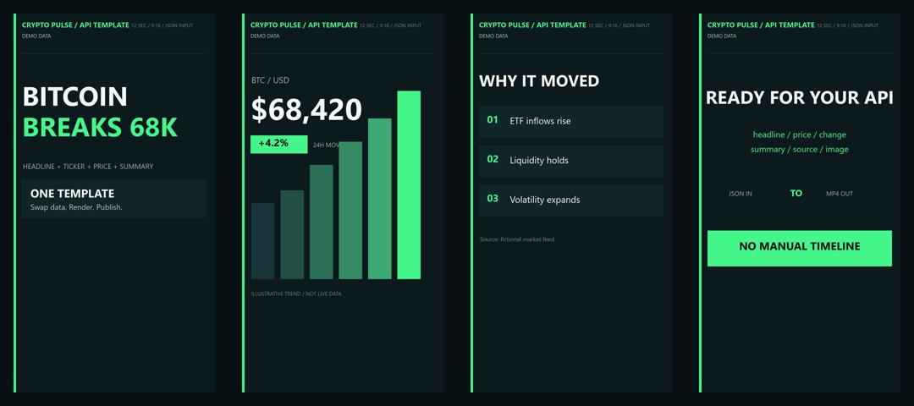

# Fast-Turnaround Creative Services

Short-form editing and content production for creators, technical teams, and small businesses.

## Vertical Short Sample

[Watch the 23-second MP4](samples/vertical-short/ledger-ten-vertical-short.mp4)

Sample specifications:

- 1080 x 1920 vertical delivery
- 23.4 seconds
- English on-screen copy
- H.264 video with AAC stereo audio
- Hook, paced sections, motion-timed progress indicator, and closing call to action

## Programmatic Crypto News Template Demo

[Watch the 12-second MP4](samples/crypto-news-template/crypto-news-template-demo.mp4)

This generic demo is rendered from [structured JSON data](samples/crypto-news-template/demo-data.json) by a reusable [PowerShell render script](samples/crypto-news-template/render-demo.ps1). It demonstrates a parameter-driven 9:16 layout for a headline, ticker, price, percentage change, short summary, source, and call to action. All displayed market values are labeled demo data and are not financial information.

Sample specifications:

- 1080 x 1920 vertical delivery
- 12 seconds, H.264 MP4
- Four timed scenes generated without manual timeline editing
- JSON-driven text fields and accent color
- Reproducible local render and contact-sheet generation

## AI-Assisted Pixel-Art Intro Concept

[Watch the 4-second motion proof](samples/pixel-art-intro/pixel-art-beauty-motion-proof.mp4)

This self-initiated concept demonstrates an original soft-luxury art direction, a fictional character, and a video-ready widescreen composition for a creator intro. The base frame was AI-assisted and the motion proof was rendered locally with FFmpeg. It is demonstration work, not a commissioned client result or a copy of an existing creator's intro.

Sample specifications:

- 1920 x 1080 widescreen motion delivery
- 4 seconds, 30 fps, H.264 MP4
- Original fictional character and environment
- Subtle seamless camera motion for concept review
- [Production notes and disclosure](samples/pixel-art-intro/)

## App Store Screenshot Concept

[View the iPhone and iPad screenshot set](samples/app-store-screenshots/)

This self-initiated concept for a fictional bookkeeping app demonstrates feature-led App Store copy, mobile-safe visual hierarchy, themed screenshot variations, and current accepted iPhone/iPad portrait dimensions. It is clearly labeled as concept work and does not present fictional screens or metrics as client results.

## Boutique Logo Concept

[View the logo board](samples/logo-concept/)

This self-initiated concept for a fictional cute-goods boutique demonstrates a primary wordmark, compact lockup, monochrome mark, and a cross-cultural visual direction that avoids copying either national flag.

## Gaming Thumbnail Concept

[View the 1280 x 720 thumbnail](samples/gaming-thumbnail/)

This self-initiated fictional gaming concept demonstrates mobile-readable hierarchy, expressive character contrast, and short high-impact copy without claiming client results or fabricated CTR.

## Documentary Thumbnail Concept

[View the 1920 x 1080 documentary thumbnail](samples/documentary-thumbnail/)

This self-initiated non-AI concept uses manually composed public-domain NASA photography, source notes, high-impact typography, and a politics/business/educational premise. It makes no client or CTR claim.

## Real-Estate Talking-Head Thumbnail Concept

[View the 1280 x 720 real-estate thumbnail](samples/real-estate-thumbnail/)

This self-initiated fictional concept demonstrates a mobile-readable YouTube thumbnail direction for first-time buyer, mortgage-rate, or housing-policy coverage. It uses an original AI-generated presenter and property visual, with documented commercial-use basis. It is not client work and makes no CTR, conversion, or performance claim.

## Robotics and AI Thumbnail Test

[View the 1280 x 720 robot AI thumbnail](samples/robot-ai-thumbnail/)

This spec test responds to a public hiring brief using the form owner's supplied rover photography. The crop, tonal treatment, layout, typography, reticle, and callouts were composed manually; the sample makes no client, CTR, revenue, or performance claim.

## Architectural Sketch and Rendering Concept

[View the sketch/rendering comparison](samples/architectural-rendering/)

This self-initiated, AI-assisted concept shows a fictional courtyard house as a perspective sketch and a polished visualization. It is clearly labeled as workflow exploration rather than commissioned or manually hand-drawn work.

## Services

- 15-60 second vertical video editing
- Caption and on-screen copy cleanup
- Hook, pacing, and section restructuring
- Music and sound-level balancing
- Platform-ready MP4 export for Shorts, Reels, and TikTok
- Parameter-driven video templates and API request fixtures
- App Store screenshot concepts and themed listing variations
- Small-business logo concepts and export-ready lockups
- Gaming and entertainment thumbnail concepts
- Documentary and educational thumbnail concepts
- Real-estate talking-head thumbnail concepts
- Robotics, AI, and technology thumbnail concepts
- AI-assisted architectural sketch and rendering concepts
- Original AI-assisted character and intro concepts with local motion finishing

Paid editing pilots typically start at USD 60. Custom animation, multi-asset packages, and recurring work are quoted after the source material and acceptance criteria are reviewed. The exact scope, price, deadline, revisions, payment timing, and delivery format are agreed in writing before work starts.

## Request Work

[Open a service request](https://github.com/220nightmore-spec/fast-turnaround-creative-services/issues/new?template=service-request.yml) with the source material, target platform, deadline, and budget. Do not include passwords, payment-account details, private customer data, or unpublished credentials.

Payment can be arranged through a PayPal invoice or another mutually agreed protected method after the written scope is accepted. Never send passwords, payment-account credentials, recovery codes, or private customer data through a service request.

## Related Work

Technical writing and documentation samples: [small-docs-and-technical-writing](https://github.com/220nightmore-spec/small-docs-and-technical-writing)
