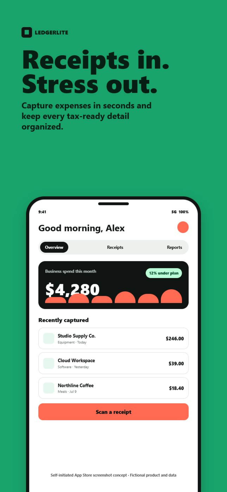
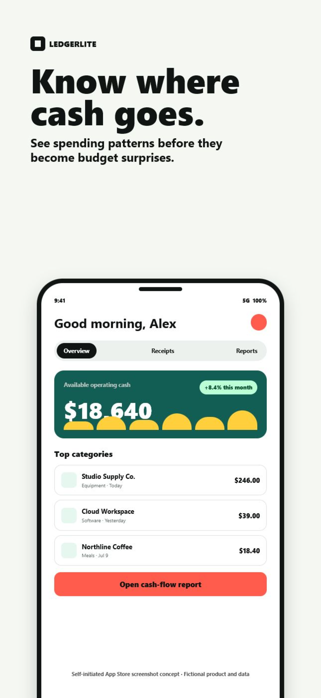
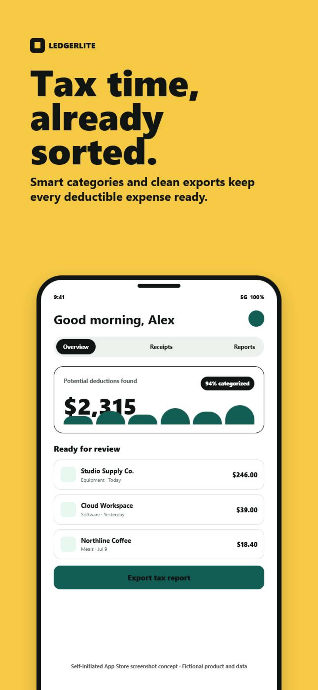
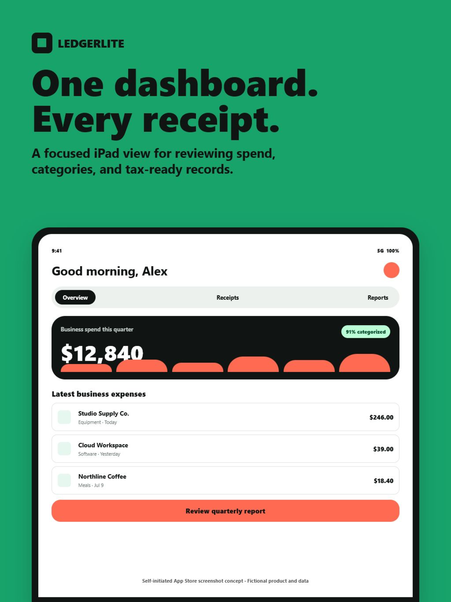

# App Store Screenshot Concept

Self-initiated promotional screenshot study for the fictional bookkeeping app **LedgerLite**. This is not client work. The sample demonstrates feature-led copy, mobile legibility, consistent device presentation, and themed variations across iPhone and iPad placements.

## Deliverables

- `iphone-01-receipts.png` - 1290 x 2796
- `iphone-02-cash-flow.png` - 1290 x 2796
- `iphone-03-tax-ready.png` - 1290 x 2796
- `ipad-01-dashboard.png` - 2048 x 2732

The dimensions are accepted portrait sizes in Apple's current [Screenshot specifications](https://developer.apple.com/help/app-store-connect/reference/app-information/screenshot-specifications). Production work would use the buyer's real in-app screens, approved claims, localization, brand system, and device requirements.

The source is a parameterized HTML composition. Every visible product name, amount, and screen is fictional and exists only to demonstrate layout capability.

