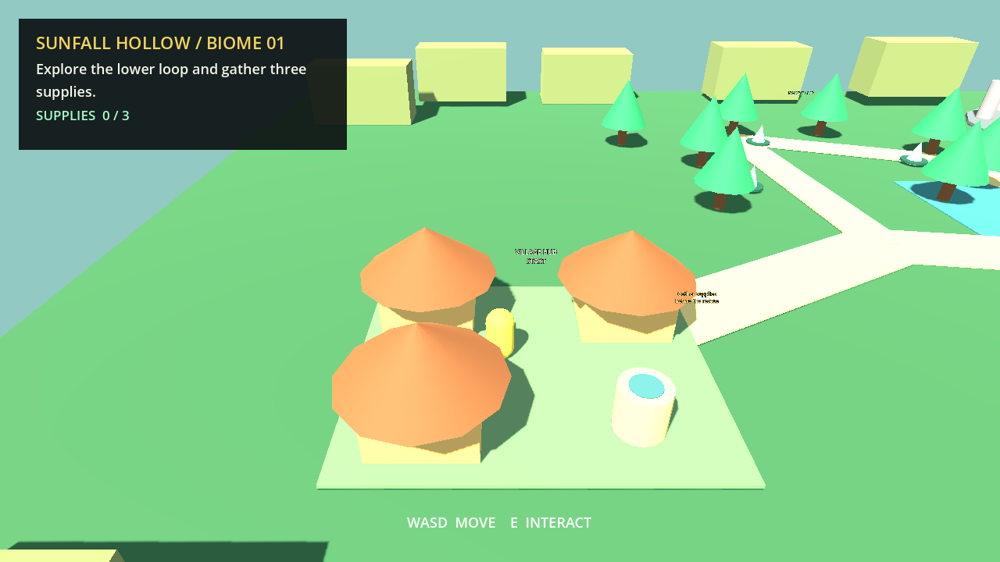
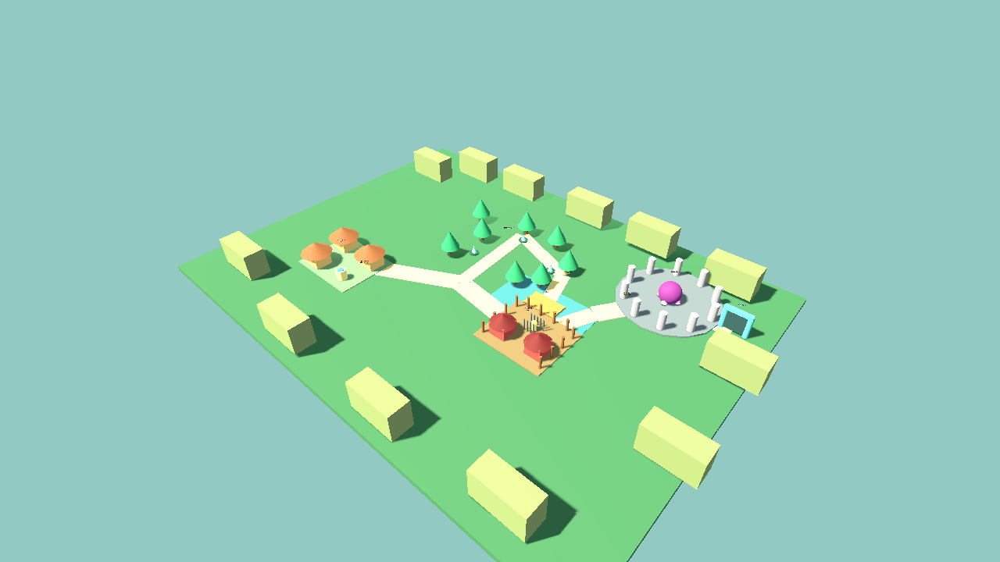

# Sunfall Hollow - Godot 3D Biome Graybox

Self-initiated level-design sample built in Godot 4.7 for a small exploration and village-building game loop.





Additional views: [resource loop and camp](screenshots/resource-camp-flow.png) | [boss arena and exit](screenshots/boss-and-exit.png)

## Playable flow

1. Start in the village hub.
2. Follow the lower exploration loop and gather three supplies.
3. Cross the bridge choke point and rescue a villager from the enemy camp.
4. Use the rescue to unlock the boss-route objective.
5. Clear the prototype boss encounter and reach the biome exit portal.

Controls: `WASD` to move and `E` to interact.

## Level-design intent

- A compact hub-and-loop structure keeps the village visible early and makes the return route understandable.
- The resource loop teaches navigation before the enemy-camp interaction.
- The bridge creates a readable choke point and visual transition.
- The camp is offset from the boss route so the rescue changes the player's next goal.
- The circular boss arena creates a strong landmark and a deliberate pacing pause before the exit.
- Large boundary silhouettes and in-world labels communicate the intended flow without an invisible rectangular wall.

## Scope and disclosure

- Original graybox and interaction code.
- Uses only Godot primitive meshes and flat materials.
- No downloaded models, AI-generated imagery, production assets, or client work.
- This is a level-flow prototype, not a claim of shipped game credits.

## Run

Open `project.godot` in Godot 4.7 and run the project.

To regenerate the screenshot gallery:

```powershell
godot --path . -- --capture
```

To run the deterministic progression check:

```powershell
godot --headless --path . -- --smoke-test
```
