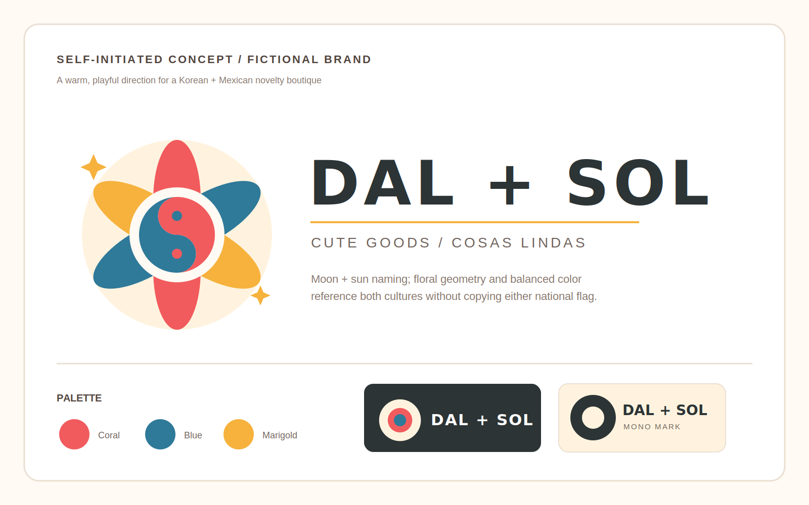

# Boutique Logo Concept

This is self-initiated concept work for a fictional cute-goods boutique. It explores a warm Korean-and-Mexican direction through balanced color, floral geometry, and a moon-and-sun naming idea without presenting fictional client work or copying either national flag.

The final client direction would be adapted to the real business name, preferred cultural references, storefront use, and print requirements. Deliverables can include a primary logo, compact badge, monochrome mark, SVG, and transparent PNG exports.
