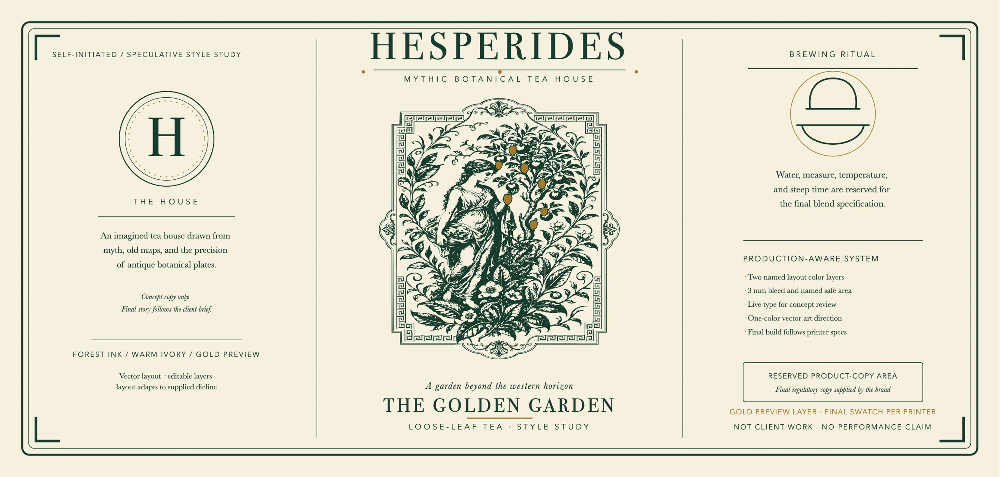
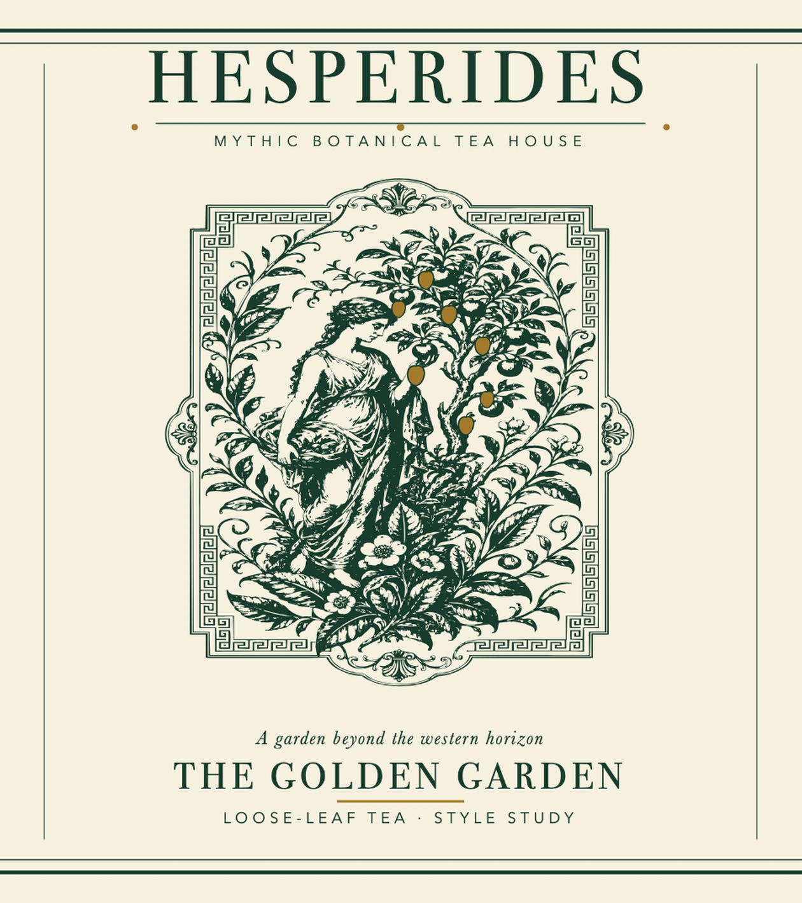

# Luxury Tea Wrap-Label Style Study

This is self-initiated, speculative work prompted by a public creative brief. It is not commissioned client work and makes no performance claim. The concept explores an antique-atlas tea-house direction through a Hesperides myth, copperplate-style botanical engraving, deep forest ink, warm ivory stock, and a restrained metallic-gold layer.

## Editable concept files

- [`hesperides-wrap-label.svg`](hesperides-wrap-label.svg) — 306 × 146 mm editable canvas with a true 300 × 140 mm trim area, 3 mm bleed on every side, and named background, forest-ink, gold-preview, and guide layers
- [`hesperides-engraving-one-color.svg`](hesperides-engraving-one-color.svg) — directional one-color auto-trace (214 paths) for concept review and further manual cleanup
- [`hesperides-engraving-source.png`](hesperides-engraving-source.png) — original AI-assisted engraving source retained for provenance and visual comparison
- `hesperides-wrap-label-preview.png` — review export rendered from the editable SVG

The red dashed line marks the 300 × 140 mm trim and the artwork extends 3 mm past it to the canvas edge. The blue dashed line marks a 3 mm safe-area inset. Both sit in the named `99 Guides` layer and are hidden in the preview. Gold elements live in a separate preview layer; the printer must specify whether the production treatment is foil, metallic ink, or another process and provide the final swatch/separation requirements.

The engraved illustration was generated as an original style study and locally vectorized with [VTracer](https://github.com/visioncortex/vtracer). The trace is intentionally reduced to one color and 214 paths, but it remains directional auto-traced art rather than final production illustration. A commissioned handoff would receive manual path cleanup against the approved concept and printer requirements.

Typography remains live for concept editing and can substitute on systems without the listed fonts. A final copy-approved production file would outline or embed the approved type. The layout currently links its vector illustration by relative path, so the asset bundle must remain together; a final PDF/SVG handoff would embed the cleaned artwork and run a printer-specific preflight. Dieline, regulatory copy, ingredients, barcode, net weight, stock, color values, and production method all remain subject to the real brand and printer brief.
