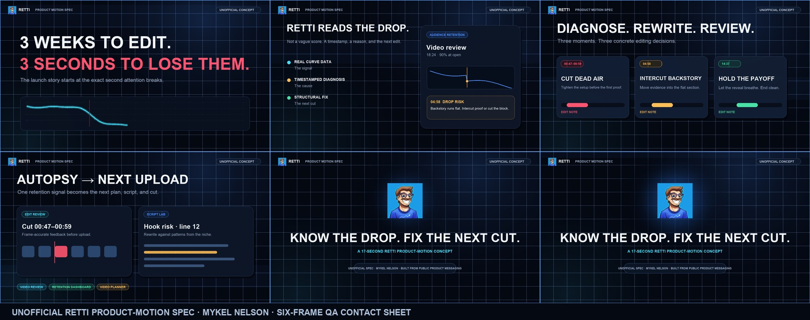

# Retti Product-Motion Spec

An original 17-second horizontal launch concept for Retti, created in response to a public July 17, 2026 request for product-launch videos and tool visualizations.

[Watch the MP4](retti-product-motion-spec.mp4)



## Scope and disclosure

- This is unsolicited demonstration work, not a commissioned client result or endorsement.
- The concept uses original layouts, motion, copy structure, graphs, interface abstractions, sound design, and animation code.
- Product feature names and positioning were researched from the public [Retti website](https://retti.ai/).
- The Retti avatar was downloaded from the company's public [X profile](https://x.com/Retti_AI) on July 17, 2026 solely for this one-off hiring concept. Retti's name, avatar, product, and trademarks remain the property of their respective owner.
- No retention, conversion, signup, or revenue result is claimed.

## Deliverable

- 1920 x 1080 landscape
- 17 seconds at 30 fps
- H.264 video with original AAC stereo sound design
- Five-scene narrative: attention loss, diagnosis, edit decisions, workflow, product lockup
- Persistent `UNOFFICIAL CONCEPT` labeling
- Six-frame QA contact sheet and cover image

## Rebuild

Requirements: Python 3, Pillow, NumPy, and FFmpeg.

```bash
python3 build.py
```

The renderer streams raw RGB frames directly to FFmpeg, synthesizes original audio locally, creates the MP4, and regenerates both review images.
